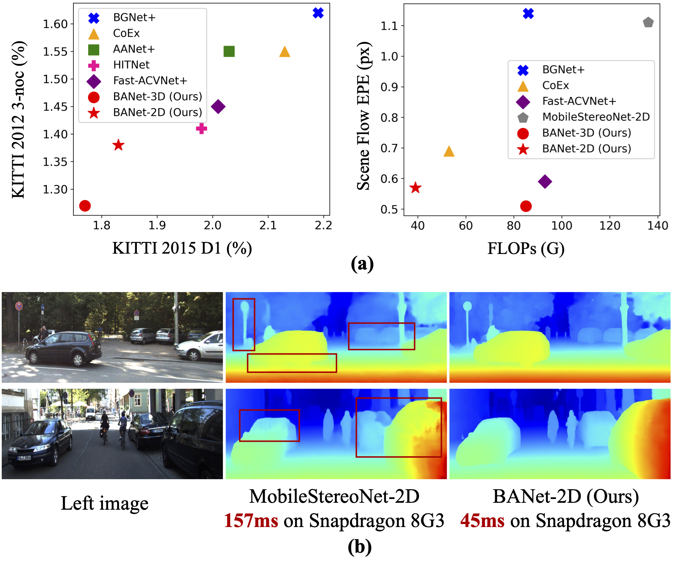
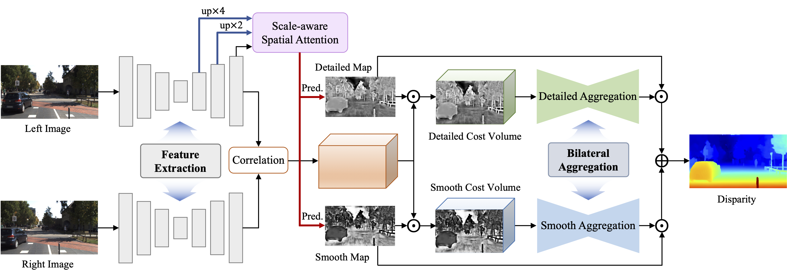

## BANet [ICCV 2025]

This repository contains the source code for our paper:

[BANet: Bilateral Aggregation Network for Mobile Stereo Matching](https://arxiv.org/pdf/2503.03259)<br/>
Gangwei Xu, Jiaxin Liu, Xianqi Wang, Junda Cheng, Yong Deng, Jinliang Zang, Yurui Chen, Xin Yang<br/>



## Network Architecture



## Pretrained Models
Pretrained models can be downloaded from [google drive](https://drive.google.com/drive/folders/1PNnTUP4ntYgzBpkvDqnhmxMJGUisqKvz?usp=drive_link)

## Citation

If you find our work useful in your research, please consider citing our paper:

```bibtex

@article{xu2025banet,
  title={BANet: Bilateral Aggregation Network for Mobile Stereo Matching},
  author={Xu, Gangwei and Liu, Jiaxin and Wang, Xianqi and Cheng, Junda and Deng, Yong and Zang, Jinliang and Chen, Yurui and Yang, Xin},
  journal={arXiv preprint arXiv:2503.03259},
  year={2025}
}

```
